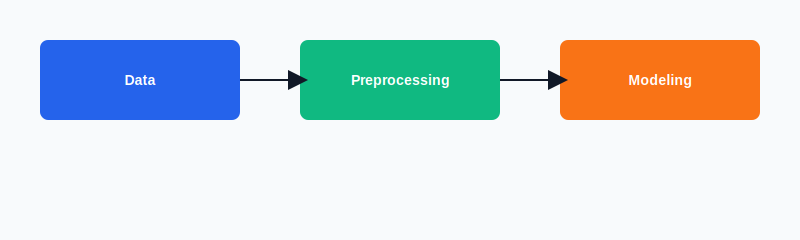

# Customer Churn Prediction

Predicting customer churn using tabular data and machine learning.

## Overview

This project demonstrates a complete workflow for predicting customer churn using Python and common ML tools. It includes a Jupyter notebook with exploratory data analysis, feature engineering, model training, and evaluation.

## Contents

- **Data/** — raw and processed datasets used for modeling.
- **Notebook/** — contains `Project.ipynb` with the full analysis and modeling pipeline.
- `requirements.txt` — Python dependencies.

## Quick Start

1. Create a virtual environment:

```bash
python -m venv .venv
```

2. Activate the environment and install dependencies:

Windows (PowerShell):

```powershell
.venv\Scripts\Activate.ps1
pip install -r requirements.txt
```

3. Launch the notebook:

```bash
jupyter notebook Notebook/Project.ipynb
```

## Notebook

Open [Notebook/Project.ipynb](Notebook/Project.ipynb) to follow the end-to-end analysis:

- Data loading and cleaning
- Exploratory data analysis (EDA)
- Feature engineering
- Model training and hyperparameter tuning
- Evaluation and interpretation

## Dataset

Place your dataset files inside the `Data/` directory. The notebook expects CSV or similar tabular files. Update paths in the notebook if you move files.

## Model & Approach

The notebook includes standard classification pipelines (e.g., logistic regression, random forest, or gradient boosting). Use cross-validation and ROC/AUC to evaluate performance.

## Visuals

Architecture diagram:



Sample data visualization:


## Results

Check the notebook's evaluation section for model metrics, confusion matrices, and feature importances.

## License

This repository is provided as-is for educational use.

## Contact

Questions or suggestions — open an issue or contact the project owner.
